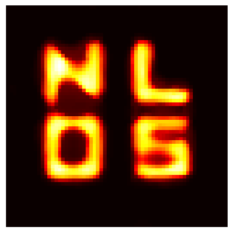
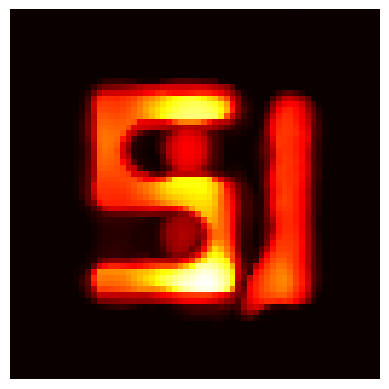
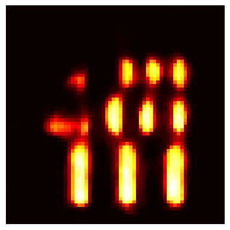

# A *Neural* Reconstruction Method for Non-Line-of-Sight Imaging

<html lang="es">
<head>
    <meta charset="UTF-8">
    <meta name="viewport" content="width=device-width, initial-scale=1.0">
    <style>
        .image-container {
            display: flex;
            justify-content: center;
            align-items: center;
            margin: auto;
        }
        .image-container img {
            margin: 0 20px;
            width: 150px;
        }
    </style>
</head>
<body>
    <div class="image-container">
        
        
        
    </div>
</body>
</html>


This project `nlos-viewpoints` is a Python implementation of the neural model presented at the paper "Non-line-of-Sight Imaging via Neural Transient Fields," by S. Shen et. al,  in IEEE Transactions on Pattern Analysis and Machine Intelligence. 

It explores its reconstruction capabilities with additional imaging features, so as to be compared with other time-of-flight methods in Non-Line-of-Sight Imaging related to this previous work. These are at the moment depth imaging and novel view synthesis.

The implementation relies on PyTorch with single-GPU training. Past training has been a NVIDIA GeForce RTX 2080 Ti, with a memory allocation of around 8 GB of VRAM in single-precision.


**Author**: Salvador Rodríguez-Sanz

**Supervisors**: Diego Gutiérrez & Albert Redó-Sánchez


## First steps

Users will need installing the required dependency packages on this repo:

```
pip3 install -r requirements.txt
```

Simulating NLOS data requires installing [mitsuba3-transient-nlos](https://github.com/diegoroyo/mitsuba3-transient-nlos) and compiling a compatible version of [Mitsuba3](https://github.com/mitsuba-renderer/mitsuba3).


## Dataset

Simulated data along with trained models is published under MIT License at Zenodo

[](https://doi.org/10.5281/zenodo.12522909)

Model weights are stored in key-value format with additional metadata from parameter settings. Its format is ".pth" and torch-specific and can be loaded at inference time by the snippet

```python
device_uri_gpu = "cuda:0"
path_model = "./data/models/planes-scene-single-oneshot-64-b8.pth"
model = NLOSNeRF(positional_encoding=True).to(device=device_uri_gpu)
dict_ = torch.load(path_model)
model.load_state_dict(dict_["model_state_dict"])
```

Further training on pretrained models is possible by joint loading of the `optimizer` and `model` states

```python
if args.reload_checkpoint:
    path_checkpoint = args.path_checkpoint
    assert os.path.exists(path_checkpoint) and os.path.isfile(path_checkpoint), f"Path: {path} not from file"
    state_dict = torch.load(path_checkpoint)
    model.load_state_dict(state_dict["model_state_dict"])
    adam.load_state_dict(state_dict["optimizer_state_dict"])
```

## Training

The script `main.py` in the root directory launches the training optimization. Code supports parametrization of the main settings associated to the learning scheme. Parameters for this task are listed by the following:

```
python3 main.py [-h] --path PATH --path_model PATH_MODEL
               [--device_gpu DEVICE_GPU] --path_results PATH_RESULTS
               [--reload_checkpoint] [--path_checkpoint PATH_CHECKPOINT]
               [--loss LOSS] [--ignore_checkpoint] --epochs EPOCHS
               --number_hemisphere_sampling NUMBER_HEMISPHERE_SAMPLING
               [--arg_start ARG_START] [--arg_end ARG_END]
               [--number_gradient_updates NUMBER_GRADIENT_UPDATES] [--lr LR]
               [--illumination_offset ILLUMINATION_OFFSET]
               [--importance_sampling] [--length_pe LENGTH_PE] [--no_pe]
               [--seed SEED] [--loss_plot]

optional arguments:
  --path PATH           Path of y-tal hdf5 path of ground truth data
  --path_model PATH_MODEL
                        Model weights
  --device_gpu DEVICE_GPU
                        URI for GPU device
  --path_results PATH_RESULTS
                        Intermediate results path
  --reload_checkpoint   indicate if training over checkpoint model
  --path_checkpoint PATH_CHECKPOINT
                        path of serialized model for reload
  --loss LOSS           loss function: MSE or SE
  --ignore_checkpoint   Flag to indicate that model checkpoint is saved
  --epochs EPOCHS       Number of iterations over whole transient simulation
  --number_hemisphere_sampling NUMBER_HEMISPHERE_SAMPLING
                        Number of sampled hemispheres
  --arg_start ARG_START
                        Argument lower bound for range of argument sampling
  --arg_end ARG_END     Argument upper bound for angle sampling
  --number_gradient_updates NUMBER_GRADIENT_UPDATES
                        Number of gradient accumulation steps
  --lr LR               Learning rate parameter associated to training
  --illumination_offset ILLUMINATION_OFFSET
                        Offset on illumination points sampling
  --importance_sampling
                        Flag to indicate if performing importance sampling
  --length_pe LENGTH_PE
                        Length of positional encoding of frequencies
  --no_pe               Flag to disable positional encoding
  --seed SEED           Seed of initialization
  --loss_plot           Flag to indicate loss plot

```


## References

> [1] Bhandari Ayush, Achuta Kadambi, and Ramesh Raskar Computational Imaging. MIT Press, 2022.

> [2] Yuki Fujimura, Takahiro Kushida, Takuya Funatomi, and YasuhiroMukaigawa. Nlos-neus: Non-line-of-sight neural implicit surface. In
2023IEEE/CVF International Conference on Computer Vision (ICCV), pages10498–10507, Los Alamitos, CA, USA, oct 2023. IEEE Computer
Society.

> [3] Siyuan Shen, Zi Wang, Ping Liu, Zhengqing Pan, Ruiqian Li, Tian Gao,Shiying Li, and Jingyi Yu. Non-line-of-sight imaging via neural
transientfields. IEEE Transactions on Pattern Analysis & Machine Intelligence,43(07):2257–2268, jul 2021.

> [4] Victor Arellano, Diego Gutierrez, and Adrian Jarabo. Fastback-projection for non-line of sight reconstruction. Opt. Express,25(10):11574–
11583, May 2017.


Also, the author acknowledges previous work that has facilitated this implementation, concretely the authors of the [mitsuba3-transient-nlos](https://github.com/diegoroyo/mitsuba3-transient-nlos) repository and its wrappers and utilities library [y-tal](https://github.com/diegoroyo/tal/).